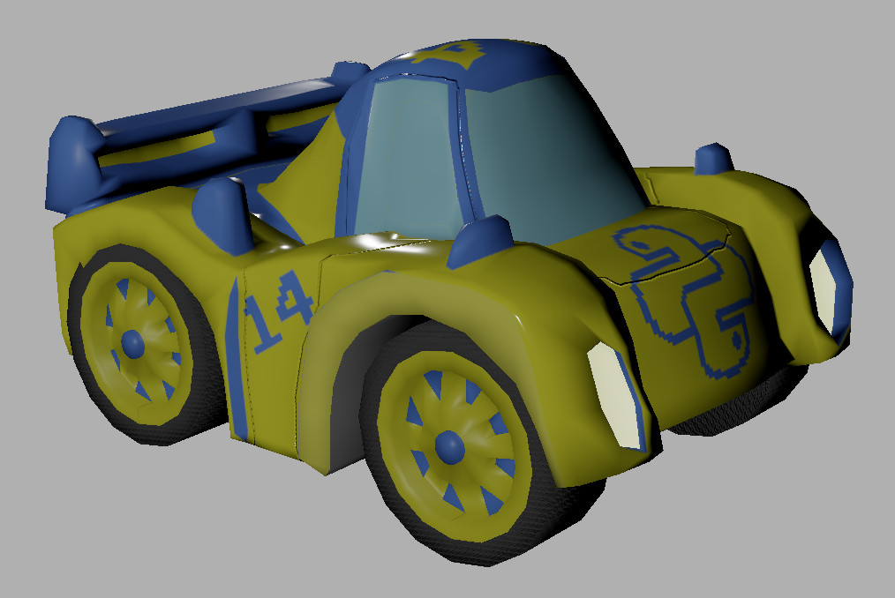

June 2020 update
================

.. cover https://www.ya2.it/_images/python_car.jpg

Hi! Here is an update about my development progresses, as of June 2020.

.. cut::

Yorg updates
------------

I am continuing my work on Yorg. I have received a request for adding the support for **Snap** packages, so I added it. Anyway, I have not tested it deeply yet.

I am contintuing the refactoring. The goal is to remove the macroscopic code smells, so I can freeze the code for the next release.

Next project updates
--------------------

I have modeled other objects. Here is one of them: the second car. Its name is *Python*. Here is a screenshot and a real-time rendering.

.. raw:: html

	 
<iframe width="560" height="315" src="https://www.youtube.com/embed/WY89_KAAfdU" frameborder="0" allow="accelerometer; autoplay; encrypted-media; gyroscope; picture-in-picture" allowfullscreen></iframe>

Support me
----------

Finally, I would love if you may consider to :ref:`support me <support-page>`. As usual, you may consider my campaign on `Patreon <https://www.patreon.com/ya2>`_ (minimum pledge: **only $1**!). Thank you very much!

.. feed-entry::
   :date: 2020-6-1
   :author: flavio
