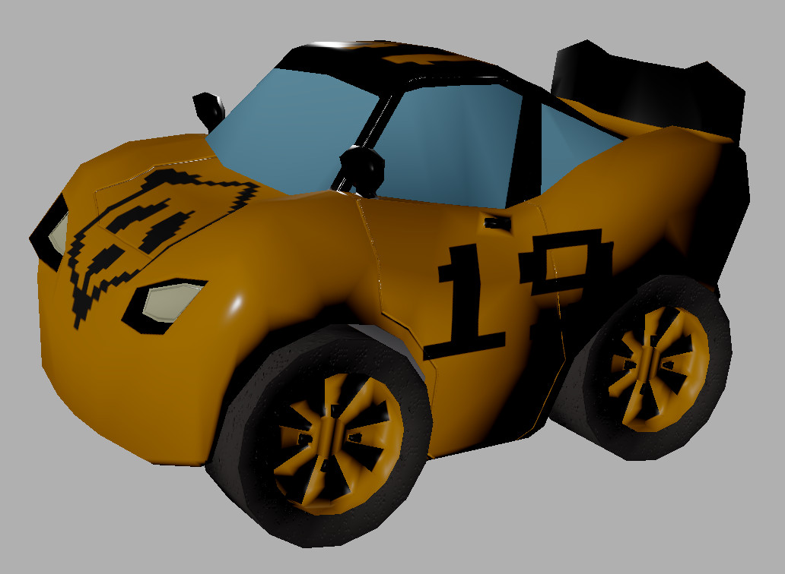

May 2020 update
===============

.. feed-entry::
   :author: flavio
   :date: 2020-5-1

Hi! Here is an update about my development progresses, as of May 2020.

.. cut::

Yorg updates
------------

I am continuing my work on Yorg. As I wrote in my previous post, I am doing several *refactorings*. This is for improving Yorg's code, so I can reuse several parts in the next project (**speeding up** its development).

The most important refactoring that I have completed recently is that I have replaced the building part. Previously, I was using *SConstruct*. Anyway, since Panda3D's developers made such an awesome work with **deploy-ng**, I wanted to better integrate my building part with theirs. So, now I only use Panda3D's deployment tools for building.

This refactoring sums to the previous development. Here is the list of the upcoming modifications to Yorg that you will find in the next release:

* added vibration for weapons and crashes;
* concurrent use of keyboard and joypads;
* a new page for configuring joypads' buttons;
* support for AppImage packages;
* CPU usage improvements;
* AI improvements;
* camera's inertia;
* removed some dependencies (*bson*, *feedparser*, *yaml*);
* optimization of network usage;
* using *setuptools*;
* *yracing* submodule
* added several unit tests.

Next project updates
--------------------

Yep, I have not "announced" the name of the new project yet (I have not registered the repository yet - it will be open source, of course). Anyway, I am working on it. I have added the support for **PBR** (physically based rendering): it uses Moguri's awesome `simplepbr <https://github.com/Moguri/panda3d-simplepbr>`_ . Moreover, I have started modeling some objects. Here is the first car. Its name is *Panda*, guess who is this love letter for. Here is a screenshot and a real-time rendering.

.. raw:: html

	 
<iframe width="560" height="315" src="https://www.youtube.com/embed/WY89_KAAfdU" frameborder="0" allow="accelerometer; autoplay; encrypted-media; gyroscope; picture-in-picture" allowfullscreen></iframe>

Please, consider that this my first model (excluding the ones that I did for self-taughting *Blender*). Please, share your suggestions if you spot anything that I could do for improving the model. The model uses the textures that *simplepbr* requests: base, metal, normal.

Support me
----------

Finally, I would love if you may consider to :ref:`support me <support-page>`. As usual, you may consider my campaign on `Patreon <https://www.patreon.com/ya2>`_ (minimum pledge: **only $1**!). Thank you very much!
