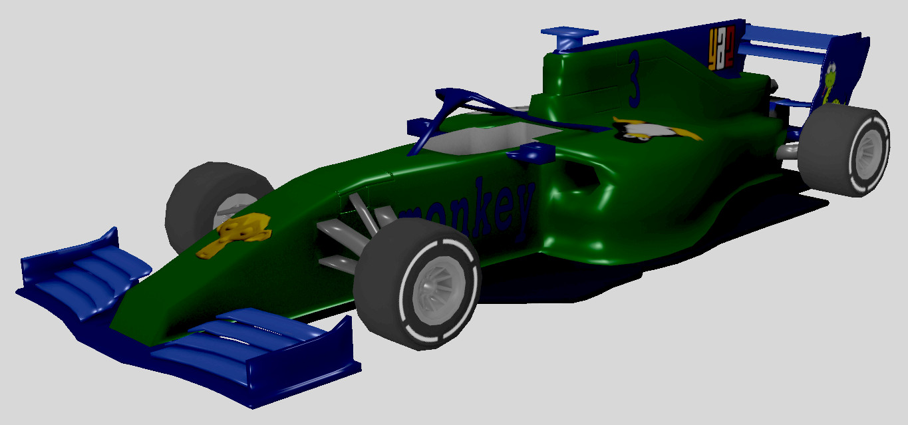

November 2020 update
====================

.. cover https://www.ya2.it/images/yorg/monkey_car.jpg

Hi! Here is an update about my development progresses, as of November 2020.

.. cut::

Yorg updates
------------

Just a fast update about Yorg. I have completed the development of the new features of the next release. We are doing several internal tests now: I am receiving many suggestions from Leandro, who is helping a lot for the new release. When the internal tests will be ok, the new release candidate will be ready.

Next project updates
--------------------

I have completed the models of the cars. Obviously, I am going to iteratively improve them in the future. Anyway, they are "ready" (imho) for a first prototype of the game. The next step is modeling the first track. Here are a screenshot of a new car and a real-time rendering.

.. raw:: html

	 
<iframe width="560" height="315" src="https://www.youtube.com/embed/csumm3oLiXk" frameborder="0" allow="accelerometer; autoplay; encrypted-media; gyroscope; picture-in-picture" allowfullscreen></iframe>

I am using `Panda3D <https://www.panda3d.org>`_, `panda3d-simplepbr <https://github.com/Moguri/panda3d-simplepbr>`_ and `panda3d-gltf <https://github.com/Moguri/panda3d-gltf>`_.

Support me
----------

Finally, I would love if you may consider to :ref:`support me <support-page>`. As usual, you may consider my campaign on `Patreon <https://www.patreon.com/ya2>`_ (minimum pledge: **only $1**!). Thank you very much!

.. feed-entry::
   :date: 2020-11-16
   :author: flavio
